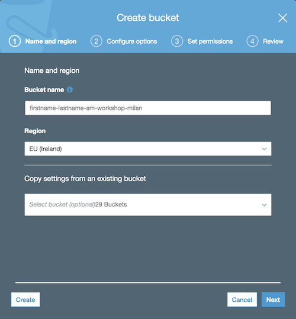
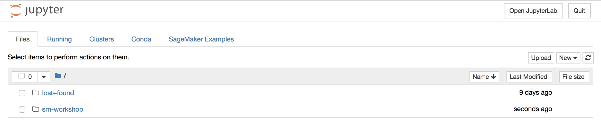

# Creating a Managed Notebook Instance

## Overview

Amazon SageMaker is a fully-managed service that enables developers and data scientists to quickly and easily build, train, and deploy machine learning models at any scale. Amazon SageMaker removes all the barriers that typically slow down developers who want to use machine learning.

Amazon SageMaker removes the complexity that holds back developer success with each of these steps. Amazon SageMaker includes modules that can be used together or independently to build, train, and deploy your machine learning models.

In this section, we will walk you through creating a S3 bucket for storing data and a Jupyter notebook instance managed by Amazon SageMaker.

## Create an Amazon S3 bucket
In this section, we will create an Amazon S3 bucket to be used for storing data of this workshop. Amazon SageMaker uses **Amazon S3** as the main storage for both data and model artifacts; you can actually use other sources when loading data into the Jupyter notebook instances, but this is outside of the scope of this lab.

1. Sign into the **AWS Management Console** at <a href="https://console.aws.amazon.com/">https://console.aws.amazon.com/</a>
2. In the upper-right corner of the AWS Management Console, confirm you are in the desired AWS region. For this workshop we will use the **EU West (Ireland)** [eu-west-1]
3. Open the **Amazon S3** console at <a href="https://console.aws.amazon.com/s3">https://console.aws.amazon.com/s3</a> or choose the Amazon S3 service in the menu.
4.	In the Amazon S3 console, click the **Create Bucket** button.
	
5.	For the **Bucket Name**, type _**[firstname-lastname]**-sm-workshop-milan_ in the text box and click Next (take note of the bucket name, as it will be needed for next workshop activities). Press **Next** to move to the next screen.
Note: if the bucket name is already taken, feel free to add an extra suffix.

	
6. Enable versioning of the objects in the bucket as shown in the screen below. Enabling versioning allows to keep different versions of the data; although this is not strictly required for this workshop, it is still a good practice to track versions of data used to train ML models.

	

	Press **Next** and then **Next** again leaving the settings as they are in the following screen.
7. Finally, click **Create Bucket** in the Review page.


## Create a managed Jupyter Notebook instance
In this section we will use an Amazon SageMaker managed Jupyter notebook instance to prepare and process data and write the code to train the model.
An **Amazon SageMaker notebook instance** is a fully managed ML compute instance running the <a href="http://jupyter.org/">**Jupyter Notebook**</a> application. Amazon SageMaker manages creating the instance and related resources. 

1. In the AWS Management Console, click on Services, type “SageMaker” and press enter.
	
	
2. You’ll be placed in the Amazon SageMaker dashboard. Click on **Create notebook instance**.
	
	
3. In the **Create notebook instance** screen

	

	1. Give the Notebook Instance a name like _notebook-instance-**[your-initials]**_

	2. Choose **ml.t2.medium** as **Notebook instance type**
	3. Choose **Create a new role** in the **IAM role** dropdown list. Notebook instances require permissions to call other services including Amazon SageMaker and Amazon S3 APIs. Choose **Specific S3 buckets** in the **Create an IAM role** window and input the name of the bucket that you have created in the previous section. Then click on **Create role**.
	
		
		If you already had a role with the proper grants to access the newly created bucket, creating a new role is not mandatory and you can just choose to use the existing role.
	4. Keep **No VPC** selected in the **VPC** dropdown list
	5. Keep **No configuration** selected in the **Lifecycle configuration** dropdown list
	6. Keep **No Custom Encryption** selected in the **Encryption key** dropdown list
	7. Finally, click on **Create notebook instance**

4. You will be redirected to the **Notebook instances** screen
	
	Wait until the notebook instance is status is **In Service** and then click on the **Open** button to be redirected to Jupyter
	
	
	
	

### Download notebook and training code to the notebook instance

For the purpose of this workshop the code required to build and train the Machine Learning model is pre-implemented and available for download from GitHub.

As a consequence, in this section we will clone the GitHub repository into the Amazon SageMaker notebook instance and access the Jupyter notebook to run training.

1. Click on **New > Terminal** in the right-hand side of the Jupyter interface
	
	

	This will open a terminal window in the Jupyter interface
	
	

2. Execute the following commands in the terminal

	```bash
	cd SageMaker
	git clone https://github.com/giuseppeporcelli/sm-workshop
	```
3. When the clone operation completes, close the terminal window and return to the Jupyter landing page. The folder **sm-workshop** will appear automatically (if not, you can hit the **Refresh** button)

	
	
4. Browse to the folder **sm-workshop** and move to the first example.
